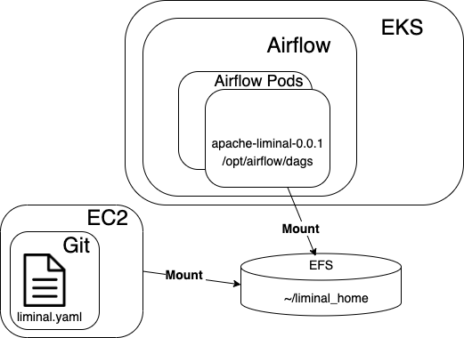

<!--
Licensed to the Apache Software Foundation (ASF) under one
or more contributor license agreements.  See the NOTICE file
distributed with this work for additional information
regarding copyright ownership.  The ASF licenses this file
to you under the Apache License, Version 2.0 (the
"License"); you may not use this file except in compliance
with the License.  You may obtain a copy of the License at

  http://www.apache.org/licenses/LICENSE-2.0

Unless required bgit y applicable law or agreed to in writing,
software distributed under the License is distributed on an
"AS IS" BASIS, WITHOUT WARRANTIES OR CONDITIONS OF ANY
KIND, either express or implied.  See the License for the
specific language governing permissions and limitations
under the License.
-->

# Install Liminal in Airflow
* [Workflow](#workflow)
* [Prerequisites](#prerequisites)
   * [Supported Distributions](#supported-distributions)
* [Get Started](#Get-Started)
   * [Mount the EFS file system onto a deployment box](#Mount-the-EFS-file-system-onto-a-deployment-box)
   * [Create a kubernetes job in order to](#A-kubernetes-job-example)
* [References and other resources](#references-and-other-resources)

## Workflow
To deploy and run liminal on airflow, we need to complete two tasks:
1. Ensure that the Liminal python package is installed inside each one of Airflow's pods (schedulers and Web Server)
2. Ensure that the user's Liminal code (i.e. Yamls) are present in each of the pods' DAGs folder (typically located in /opt/airflow/dags)

The first task is accomplished by iterating over Airflows' k8s pods and running a pip install on each of them.

The second task is accomplished by using a folder on a shared filesystem (EFS) to host the airflow DAGs (and Liminal Yamls). \
This folder is mounted into Airflow pods' DAGs folder - thus enables each of the pods to pick the files up and run the Liminal DAGs.

The process of liminal is emphasized on the following diagram:



## Prerequisites
Before you begin, ensure you have met the following requirements: 
* You have the kubectl command line [(kubectl CLI)][homebrew-kubectl] installed
* You have the current [context][cluster-access-kubeconfig] in kubernetes' kubeconfig file
* You have [Airflow on Kubernetes with AWS EFS][airflowInstallation]

### Supported Distributions

|Distribution | Versions |
|-|-|
|[Airflow][airflowImage] | apache/airflow:1.10.14-python3.8 |
|[Airflow Helm Chart][airflowChart] | 7.16.0 |

#### You may need to add the Repo

```sh
helm repo add airflow-stable https://airflow-helm.github.io/charts
helm repo update
```

## Get Started
There are a couple of ways to deploy Yamls in Airflow.

1. [Mount the EFS file system onto a deployment box](#Mount-the-EFS-file-system-onto-a-deployment-box)
2. [Create a kubernetes job in order to](#A-kubernetes-job-example):
    * Sync Yamls and liminal_dags.py
    * Add a requirements txt file for the liminal package installation

### Mount the EFS file system onto a deployment box
Our goal is to deploy the actual Yamls (DAGs) into airflow - by placing the Yaml files in each components\` `/opt/airflow/dags` folder.

There are multiple ways to achieve this.

Our recommended approach is to use EFS as a shared folder containing the Liminal Yamls. \
To this end, you will need to perform the deployment from a (separate) linux box, which can get hold of the Liminal Yamls and deploy them into the EFS - which we shall name "the deployment box".

One time setup:

1. Use the EFS file system that you created for Airflow DAGs folder
2. Mount the EFS file system onto a deployment box:
```sudo mount -t nfs4 -o nfsvers=4.1,rsize=1048576,wsize=1048576,hard,timeo=600,retrans=2,noresvport <EFS_ID>:/ /mnt/efs```
3. Create a folder on an EFS drive. This will be our target for deployment
```mkdir -p /mnt/efs/opt/airflow/liminal_home```
4. ```export LIMINAL_HOME=/mnt/efs/opt/airflow/liminal_home```
5. Ensure liminal package to be installed on every restart:
    ```
    echo "apache-liminal==0.0.1" > $LIMINAL_HOME/requirements.txt
    ```
6. Rollout restart the Airflow components:
    ```
    kubectl rollout restart statefulset airflow-worker
    kubectl rollout restart deployment airflow-web
    kubectl rollout restart deployment airflow-scheduler
    ```
6. Find and copy the liminal_dags.py that generates the Yamls:
    ```
    kubectl exec -it <AirflowComponent> -n <Namespace> -- bash -c "find '/home/airflow/' -path '*liminal/runners/airflow/dag/liminal_dags.py'| xargs -I {} cp -p {} /opt/airflow/dags/"
    ```
7. Follow the guide <<<>>> for deploying Airflow on K8S, with EFS mount.
Point the pods' PV to the right EFS folder, like so:
    ```
    volumeMounts:
        - name: efs-data
          mountPath: /opt/airflow/dags
    ```
    where efs-data is a PVC pointing to `<EFS_ID>:/opt/airflow/liminal_home`

Once this setup is done (one time), you have:
1. A deployment box which can deploy Liminal to an EFS folder
2. Airflow pods which will pick up the Yamls from that folder automatically.

Each time you want to deploy the Liminal Yamls from the deployment box:
```
liminal deploy --path <<<path to liminal user code>>>
```

### A kubernetes job example
    apiVersion: batch/v1
    kind: Job
    metadata:
      namespace: production
      name: airflower-production-git
    spec:
      activeDeadlineSeconds: 60
      backoffLimit: 1
      template:
        spec:
          containers:
          - name: git
            image: alpine/git
            command: ["/bin/sh","-c"]
            args:
              - cd /dags;
                echo "apache-liminal" > requirements.txt;
                mkdir -p pipelines && cd pipelines;
                rm -rf .git;
                git init;
                git remote add -f origin https://github.com/apache/incubator-liminal.git;
                git config core.sparsecheckout true;
                echo examples/liminal-getting-started/ >> .git/info/sparse-checkout;
                echo liminal/runners/airflow/dag/liminal_dags.py >> .git/info/sparse-checkout;
                git pull origin master;
                mv liminal/runners/airflow/dag/liminal_dags.py $AIRFLOW_HOME/dags;
                rm -rf liminal;
            volumeMounts:
            - mountPath: /dags
              name: dags
          volumes:
          - name: dags
            persistentVolumeClaim:
              claimName: airflow-production
          restartPolicy: Never

### How it works
1. Airflow helm chart in version [7.16.0][airflow-helm-chart-7.16.0] will install requirements that are located under the default location of your DAGs: ~/airflow/dags. \
Add liminal to run automatically at startup in Airflow:
    ```
    echo "apache-liminal" > requirements.txt;
    ```
2. Clone the getting started project to the DAGs pipelines folder:
    ```
    mkdir -p pipelines && cd pipelines;
    rm -rf .git;
    git init;
    git remote add -f origin https://github.com/apache/incubator-liminal.git;
    git config core.sparsecheckout true;
    echo examples/liminal-getting-started/ >> .git/info/sparse-checkout;
    echo liminal/runners/airflow/dag/liminal_dags.py >> .git/info/sparse-checkout;
    git pull origin master;
    ```
3. Add the liminal_dags.py generator to the DAGs folder:
    ```
    mv liminal/runners/airflow/dag/liminal_dags.py $AIRFLOW_HOME/dags;
    rm -rf liminal;
    ```

4. Rollout restart the Airflow components:
    ```
    kubectl rollout restart statefulset airflow-worker
    kubectl rollout restart deployment airflow-web
    kubectl rollout restart deployment airflow-scheduler
    ```


## References and other resources

* You can refer to the following blog with a step by step configuration on [Setting up Airflow on Kubernetes with AWS EFS][airflowInstallation]

[airflow-helm-chart-7.16.0]: <https://github.com/airflow-helm/charts/tree/airflow-7.16.0>
[homebrew-kubectl]: <https://formulae.brew.sh/formula/kubernetes-cli>
[cluster-access-kubeconfig]: <https://kubernetes.io/docs/concepts/configuration/organize-cluster-access-kubeconfig/#context>
[liminal-yaml-file]: <https://github.com/apache/incubator-liminal#example-yaml-config-file>
[liminal-getting-started-project]: <https://github.com/apache/incubator-liminal/tree/master/examples/liminal-getting-started>
[liminal-installation-script]: <https://github.com/apache/incubator-liminal/tree/master/docs/source/install_liminal_in_airflow_on_kubernetes.sh>
[findAirflowComponents]: <https://github.com/joemccann/dillinger.git>
[airflowChart]: <https://github.com/airflow-helm/charts/tree/main/charts/airflow>
[airflowInstallation]: <https://medium.com/terragoneng/setting-up-airflow-on-kubernetes-with-aws-efs-c659f3a16292>
[airflowImage]: <https://hub.docker.com/layers/apache/airflow/1.10.12-python3.6/images/sha256-9ea9e5ca66bd17632241889ab248fe3852c9f3c830ed299a8ecaa8a13ac2082f?context=explore>